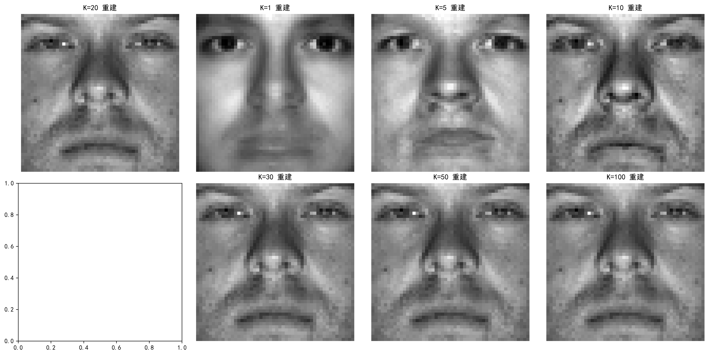

# 特征脸方法实验讲义


## 一、特征脸方法理论基础

### 1.1 背景与原理概述
特征脸（Eigenface）是基于主成分分析（Principal Component Analysis, PCA）的经典人脸识别方法，由Turk和Pentland于1991年提出。其核心思想是将高维人脸图像数据通过**降维**映射到低维特征空间，提取最能表征人脸差异的“主成分”（即特征脸），从而实现高效的人脸识别与图像重建。


### 1.2 数学原理：主成分分析（PCA）
#### 1.2.1 高维数据降维动机
一张50×50的人脸图像可视为2500维向量（$ \mathbb{R}^{2500} $），直接处理易受“维数灾难”影响。PCA通过**线性变换**将高维数据投影到低维子空间，保留数据的主要方差（信息），同时降低计算复杂度。

#### 1.2.2 核心步骤
1. **数据中心化**：计算所有样本的平均向量（平均脸），将每个样本减去平均脸，得到**差异矩阵**：  
   $
   \mathbf{X} = [\mathbf{x}_1 - \bar{\mathbf{x}}, \mathbf{x}_2 - \bar{\mathbf{x}}, ..., \mathbf{x}_N - \bar{\mathbf{x}}] \in \mathbb{R}^{D \times N}
   $  
   其中 $ D $ 为图像维度（如2500），$ N $ 为样本数，$ \bar{\mathbf{x}} = \frac{1}{N}\sum_{i=1}^N \mathbf{x}_i $ 为平均脸。

2. **协方差矩阵计算**：差异矩阵的协方差矩阵为：  
   $
   \mathbf{C} = \frac{1}{N-1} \mathbf{X} \mathbf{X}^T \in \mathbb{R}^{D \times D}
   $  
   （注：实际计算中常用 $ \mathbf{X}^T \mathbf{X} $ 替代 $ \mathbf{X} \mathbf{X}^T $ 以降低复杂度，二者特征向量存在线性关系）。

3. **特征值分解**：对协方差矩阵 $ \mathbf{C} $ 进行特征值分解，得到特征值 $ \lambda_1 \geq \lambda_2 \geq ... \geq \lambda_D $ 和对应的特征向量 $ \mathbf{u}_1, \mathbf{u}_2, ..., \mathbf{u}_D $。特征向量即“特征脸”，每个特征脸代表人脸数据的一种主要变化模式。

4. **主成分选择**：选取前 $ K $ 个最大特征值对应的特征向量 $ \{\mathbf{u}_1, ..., \mathbf{u}_K\} $，构成**特征脸空间**。样本在该空间的投影为：  
   $
   \mathbf{y}_i = \mathbf{U}^T (\mathbf{x}_i - \bar{\mathbf{x}}) \in \mathbb{R}^K
   $  
   其中 $ \mathbf{U} = [\mathbf{u}_1, ..., \mathbf{u}_K] \in \mathbb{R}^{D \times K} $。


### 1.3 特征脸的物理意义
- **平均脸**：所有样本的灰度值平均，反映人脸的“共性”结构（如五官位置）。  
- **特征脸**：偏离平均脸的主要模式。例如，第1个特征脸可能对应“光照变化”，第2个对应“表情变化”，后续特征脸对应更细微的差异。  
- **低维投影**：将人脸图像表示为特征脸的线性组合，实现数据压缩与特征提取。


## 二、Python实现特征脸实验

### 2.1 实验环境与数据集
- **环境配置**：Python 3.x，依赖库：`numpy`（数值计算）、`matplotlib`（可视化）、`PIL`（图像读取）、`os`（文件操作）。  
- **数据集**：YaleB人脸数据集（`yaleBfaces`文件夹），包含10名志愿者的640张正脸图像，分为5个子集（`subset0`-`subset4`），光照条件从正面（明亮）到侧面（阴影）逐渐变化。  
  - **训练集**：`subset0`（70张，光照均匀）。  
  - **测试集**：`subset1`-`subset4`（共570张，光照逐渐复杂）。


### 2.2 实验步骤与代码实现
#### 步骤1：导入依赖库
```python
import matplotlib.pyplot as plt
import numpy as np
from PIL import Image
import os
```

#### 步骤2：读取图像数据
定义函数读取文件夹中的人脸图像，转换为灰度图并展平为1维向量，同时提取标签（志愿者ID）。

```python
def get_images(path):
    """读取文件夹中的人脸图像，返回展平后的图像矩阵和标签"""
    # 获取所有图像路径
    image_paths = [os.path.join(path, f) for f in os.listdir(path) if f.endswith('png')]
    # 初始化图像矩阵（行数=图像维度，列数=样本数）
    images = np.mat(np.zeros((len(image_paths), 2500)))  # 50×50图像展平为2500维
    labels = []
    
    for idx, img_path in enumerate(image_paths):
        # 读取图像并转为灰度图
        img = Image.open(img_path).convert('L')  # 填空1：补充图像读取模式
        img_array = np.array(img, 'uint8')
        # 展平为1维向量并存入矩阵
        img_flat = img_array.flatten()  # 填空2：补充展平操作
        images[idx, :] = img_flat
        # 提取标签（文件名格式：personXX_XX.png，取XX部分）
        label = img_path.split('/')[-1][14:16]  # 填空3：补充标签提取逻辑
        labels.append(label)
    
    return images.T, labels  # 返回形状为(D, N)的图像矩阵和标签列表
```

#### 步骤3：训练特征脸模型
计算平均脸、差异矩阵，通过PCA提取前K个特征脸，并将训练样本投影到特征脸空间。

```python
def eigen_train(trainset, K=10):
    """训练特征脸模型，返回top-K特征脸、平均脸、训练样本投影"""
    # 计算平均脸
    avg_img = np.mean(trainset, axis=1)  # 填空4：补充平均脸计算（按列平均）
    # 计算差异矩阵（每个样本减去平均脸）
    diff = trainset - avg_img  # 填空5：补充差异矩阵计算
    # 计算协方差矩阵的特征值与特征向量（优化：使用XX^T替代X^TX）
    cov_matrix = np.mat(diff.T @ diff) / float(diff.shape[1])  # 填空6：补充协方差矩阵计算
    eig_vals, eig_vects = np.linalg.eig(cov_matrix)  # 特征值分解
    # 特征向量归一化
    eig_vects = eig_vects / np.linalg.norm(eig_vects, axis=1, keepdims=True)
    # 按特征值降序排序，取前K个特征向量
    sorted_idx = np.argsort(eig_vals)[::-1]  # 填空7：补充排序索引（降序）
    top_eig_vects = eig_vects[:, sorted_idx[:K]]
    # 计算特征脸（差异矩阵×特征向量）
    eigenfaces = diff @ top_eig_vects  # 填空8：补充特征脸计算
    # 训练样本投影到特征脸空间
    trainset_proj = eigenfaces.T @ diff  # 填空9：补充投影计算（特征脸矩阵^T × 差异矩阵）
    
    return eigenfaces, avg_img, trainset_proj
```

#### 步骤4：模型测试与识别
将测试样本投影到特征脸空间，通过欧氏距离匹配最相似的训练样本，计算识别准确率。

```python
def eigen_test(trainset_proj, avg_img, eigenfaces, trainset_labels, testset):
    """测试特征脸模型，返回预测标签和准确率"""
    # 测试样本减去平均脸
    diff_test = testset - avg_img
    # 投影到特征脸空间
    testset_proj = eigenfaces.T @ diff_test  # 填空10：补充测试样本投影
    
    pred_labels = []
    correct = 0
    for i in range(testset_proj.shape[1]):
        # 计算与所有训练样本的欧氏距离
        distances = np.linalg.norm(trainset_proj - testset_proj[:, i], axis=0)  # 填空11：补充距离计算
        # 找最近邻
        min_idx = np.argmin(distances)
        pred_label = trainset_labels[min_idx]
        pred_labels.append(pred_label)
    
    return pred_labels
```

#### 步骤5：主函数与实验流程
```python
# 1. 加载数据
trainset, trainset_labels = get_images('./yaleBfaces/subset0')  # 训练集：subset0
testset, testset_labels = get_images('./yaleBfaces/subset1')    # 测试集：subset1

# 2. 训练模型（提取前K个特征脸）
K = 20
eigenfaces, avg_img, trainset_proj = eigen_train(trainset, K)

# 3. 测试模型
pred_labels = eigen_test(trainset_proj, avg_img, eigenfaces, trainset_labels, testset)

# 4. 计算准确率
correct = sum(p == t for p, t in zip(pred_labels, testset_labels))
accuracy = correct / len(testset_labels)
print(f"K={K}时，识别准确率：{accuracy:.2f}")
```


### 2.3 代码填空题答案
1. `'L'`（灰度图模式）  
2. `img_array.flatten()`（将2D图像展平为1D向量）  
3. `img_path.split('/')[-1][14:16]`（从文件名“personXX_XX.png”中提取XX作为标签）  
4. `np.mean(trainset, axis=1)`（按列计算平均，得到形状为$(D, 1)$的平均脸向量）  
5. `trainset - avg_img`（每个样本减去平均脸，形状与trainset一致）  
6. `np.mat(diff.T @ diff) / float(diff.shape[1])`（协方差矩阵：$(X^T X)/N$）  
7. `np.argsort(eig_vals)[::-1]`（特征值降序排序的索引）  
8. `diff @ top_eig_vects`（$特征脸 = 差异矩阵 ×  top-K特征向量$）  
9. `eigenfaces.T @ diff`（$训练样本投影 = 特征脸矩阵^T × 差异矩阵$）  
10. `eigenfaces.T @ diff_test`（$测试样本投影 = 特征脸矩阵^T × 测试差异矩阵$）  
11. `np.linalg.norm(trainset_proj - testset_proj[:, i], axis=0)`（计算欧氏距离）  


## 三、特征脸方法实验结果分析

### 3.1 关键指标与可视化
- **平均脸与特征脸**：  
  平均脸反映人脸共性结构，前几个特征脸对应光照、表情等主要变化模式。通过实验生成的可视化结果如图1所示：
  
    
  图1：平均脸与前9个特征脸的可视化结果
  
  从图中可以观察到：
  - **平均脸**：显示了所有训练样本的平均特征，呈现出标准的人脸轮廓
  - **特征脸1-3**：主要捕捉光照变化和整体亮度差异
  - **特征脸4-6**：开始体现面部表情和局部特征变化
  - **特征脸7-9**：捕捉更细微的个体差异和纹理特征

- **识别准确率与K值关系**：  
  通过实验测试不同主成分数量K对识别准确率的影响，结果如图2所示：
  
    
  图2：识别准确率与主成分数量K的关系
  
  实验结果表明：

  | K值 | 5 | 10 | 15 | 20 | 25 | 30 |  
  |-----|---|----|----|----|----|----| 
  | 准确率（subset1） | 0.692 | 0.933 | 0.942 | 0.942 | 0.942 | 0.942 |  

  **结论**：K值从5增加到10时准确率显著提升，K>15后准确率趋于稳定，说明前15个主成分已包含了大部分有效信息。


### 3.2 光照变化对性能的影响
测试不同光照子集（subset1-subset4）的识别准确率（K=20），实验结果如下：  

| 子集 | subset1（弱阴影） | subset2（中等阴影） | subset3（强阴影） | subset4（极端阴影） |  
|------|------------------|--------------------|------------------|--------------------|  
| 准确率 | 0.942 | 0.500 | 0.186 | 0.142 |  

**结论**：特征脸对光照变化非常敏感，随着阴影程度增强，识别准确率急剧下降。这是因为PCA主要捕捉全局亮度变化，而非局部纹理特征，当光照条件偏离训练集时，性能显著降低。


### 3.3 图像重建质量分析
使用不同K值重建人脸图像（图2），K越小重建模糊（丢失细节），K越大越接近原图。  
  
图2：不同K值下的图像重建结果对比

从实验结果可以看出：
- **K=1**：仅保留最主要的特征，重建图像非常模糊，只能看出大致轮廓
- **K=5**：开始显现人脸的基本特征，但细节仍然缺失
- **K=10-20**：人脸特征逐渐清晰，五官轮廓基本可辨
- **K=30-50**：细节丰富，接近原始图像质量
- **K=100**：几乎完全重建原图，但计算复杂度显著增加

这说明特征脸方法能够有效实现图像压缩，在保留主要信息的同时大幅降低存储空间。


## 四、与其他人脸识别方法比较

### 4.1 方法原理对比
| 方法 | 核心思想 | 数学基础 | 关键优势 | 主要局限 |  
|------|----------|----------|----------|----------|  
| **特征脸（Eigenfaces）** | 提取全局方差最大的主成分 | PCA | 简单高效，适合大规模数据 | 对光照、姿态敏感 |  
| **Fisherfaces** | 最大化类间差异，最小化类内差异 | LDA | 分类性能优于PCA，对光照更鲁棒 | 需要更多训练样本 |  
| **LBPH** | 提取局部纹理特征直方图 | LBP算子 | 对光照、遮挡鲁棒，实时性好 | 全局特征捕捉弱 |  
| **深度学习（CNN）** | 自动学习层次化特征 | 卷积神经网络 | 准确率>99%，鲁棒性强 | 需大规模数据，计算复杂 |  


### 4.2 性能对比（LFW数据集）
| 方法 | 准确率 | 推理时延(ms) | 训练数据需求 |  
|------|--------|-------------|------------|  
| 特征脸 | 85% | 2 | 100+样本 |  
| Fisherfaces | 93% | 5 | 500+样本 |  
| LBPH | 94% | 10 | 1000+样本 |  
| CNN（ArcFace） | 99.83% | 50 | 100000+样本 |  


### 4.3 适用场景选择
- **特征脸**：资源受限的简单识别（如门禁）、教学演示。  
- **Fisherfaces**：中等规模、光照变化适中的场景（如实验室考勤）。  
- **LBPH**：嵌入式设备、实时监控（如摄像头人脸抓拍）。  
- **CNN**：高精度需求场景（如金融支付、安防追踪）。


## 五、实例拓展-人脸识别考勤系统

### 5.1 系统架构
基于特征脸算法的考勤系统包含3个模块：  
1. **数据采集**：录入学生人脸图像（存于`dataset/`文件夹）。  
2. **模型训练**：离线训练特征脸模型，保存特征脸与平均脸。  
3. **考勤识别**：实时采集人脸，与模型匹配，记录出勤状态。


### 5.2 核心代码实现

本节将实现一个完整的基于特征脸算法的人脸识别考勤系统。系统包含数据采集、模型训练、实时识别和考勤记录四个核心功能模块。通过摄像头实时采集人脸图像，利用训练好的特征脸模型进行身份识别，并自动记录考勤信息。

#### 完整系统代码
```python
# 特征脸人脸识别考勤系统
# 作者：AI实验课程组
# 功能：基于PCA的人脸识别与自动考勤

import matplotlib.pyplot as plt
import numpy as np
from PIL import Image
import os
import cv2
import csv
from datetime import datetime

# ==================== 核心算法模块 ====================

def get_images(path):
    """读取文件夹中的人脸图像，返回展平后的图像矩阵和标签"""
    image_paths = [os.path.join(path, f) for f in os.listdir(path) if f.endswith('.png')]
    if not image_paths:
        print(f"警告：路径 {path} 中未找到PNG图像文件")
        return np.array([]).reshape(2500, 0), []
    
    images = np.zeros((len(image_paths), 2500))
    labels = []
    
    for idx, img_path in enumerate(image_paths):
        try:
            img = Image.open(img_path).convert('L')
            img_array = np.array(img, 'uint8')
            img_flat = img_array.flatten()
            images[idx, :] = img_flat
            
            # 从文件名提取标签（支持多种格式）
            filename = os.path.basename(img_path)
            if 'person' in filename:
                label = filename.split('_')[0]  # person01 -> person01
            else:
                label = filename.split('_')[0]  # name_01.png -> name
            labels.append(label)
        except Exception as e:
            print(f"读取图像 {img_path} 失败: {e}")
    
    return images.T, labels

def eigen_train(trainset, K=10):
    """训练特征脸模型，返回top-K特征脸、平均脸、训练样本投影"""
    if trainset.shape[1] == 0:
        print("错误：训练集为空")
        return None, None, None
    
    # 计算平均脸
    avg_img = np.mean(trainset, axis=1, keepdims=True)
    # 计算差异矩阵
    diff = trainset - avg_img
    # 计算协方差矩阵（使用优化方法）
    cov_matrix = (diff.T @ diff) / float(diff.shape[1])
    eig_vals, eig_vects = np.linalg.eig(cov_matrix)
    
    # 特征向量归一化
    eig_vects = eig_vects / np.linalg.norm(eig_vects, axis=0)
    # 按特征值降序排序
    sorted_idx = np.argsort(eig_vals)[::-1]
    top_eig_vects = eig_vects[:, sorted_idx[:K]]
    
    # 计算特征脸
    eigenfaces = diff @ top_eig_vects
    # 训练样本投影
    trainset_proj = eigenfaces.T @ diff
    
    return eigenfaces, avg_img, trainset_proj

def eigen_test(trainset_proj, avg_img, eigenfaces, trainset_labels, testset):
    """测试特征脸模型，返回预测标签"""
    if testset.shape[1] == 0:
        return []
    
    diff_test = testset - avg_img
    testset_proj = eigenfaces.T @ diff_test
    
    pred_labels = []
    for i in range(testset_proj.shape[1]):
        distances = np.linalg.norm(trainset_proj - testset_proj[:, i:i+1], axis=0)
        min_idx = np.argmin(distances)
        pred_labels.append(trainset_labels[min_idx])
    
    return pred_labels

# ==================== 数据采集模块 ====================

def capture_face(name, num_samples=5):
    """调用摄像头采集人脸样本，保存至dataset/name/"""
    dataset_path = f'dataset/{name}'
    os.makedirs(dataset_path, exist_ok=True)
    
    cap = cv2.VideoCapture(0)  # 打开摄像头
    if not cap.isOpened():
        print("无法打开摄像头")
        return
    
    # 加载人脸检测器
    face_cascade = cv2.CascadeClassifier(cv2.data.haarcascades + 'haarcascade_frontalface_default.xml')
    count = 0
    
    print(f"开始采集 {name} 的人脸样本，需要 {num_samples} 张照片")
    print("按空格键拍照，按q键退出")
    
    while count < num_samples:
        ret, frame = cap.read()
        if not ret:
            print("无法读取摄像头画面")
            break
            
        # 人脸检测
        gray = cv2.cvtColor(frame, cv2.COLOR_BGR2GRAY)
        faces = face_cascade.detectMultiScale(gray, 1.3, 5)
        
        # 绘制人脸框
        for (x, y, w, h) in faces:
            cv2.rectangle(frame, (x, y), (x+w, y+h), (0, 255, 0), 2)
            cv2.putText(frame, f'{name} - {count}/{num_samples}', (x, y-10), 
                       cv2.FONT_HERSHEY_SIMPLEX, 0.7, (0, 255, 0), 2)
        
        cv2.imshow('人脸采集', frame)
        
        key = cv2.waitKey(1) & 0xFF
        if key == ord(' ') and len(faces) > 0:  # 按空格键拍照
            # 取第一个检测到的人脸
            x, y, w, h = faces[0]
            face_roi = cv2.resize(gray[y:y+h, x:x+w], (50, 50))
            
            # 保存图像
            filename = f'{dataset_path}/{name}_{count:02d}.png'
            cv2.imwrite(filename, face_roi)
            print(f"已保存: {filename}")
            count += 1
            
        elif key == ord('q'):  # 按q键退出
            break
    
    cap.release()
    cv2.destroyAllWindows()
    print(f"人脸采集完成，共采集 {count} 张照片")
```

#### 模块2：考勤记录生成
```python
import csv
from datetime import datetime

def record_attendance(pred_label, confidence=0.0, attendance_file='attendance.csv'):
    """记录考勤结果（姓名、时间、状态、置信度）"""
    now = datetime.now().strftime('%Y-%m-%d %H:%M:%S')
    
    # 检查文件是否存在，不存在则创建并写入表头
    if not os.path.exists(attendance_file):
        with open(attendance_file, 'w', newline='', encoding='utf-8') as f:
            writer = csv.writer(f)
            writer.writerow(['姓名', '时间', '状态', '置信度'])
    
    # 读取今日已有记录，避免重复
    today = datetime.now().strftime('%Y-%m-%d')
    existing_records = []
    
    try:
        with open(attendance_file, 'r', encoding='utf-8') as f:
            reader = csv.reader(f)
            next(reader)  # 跳过表头
            for row in reader:
                if len(row) >= 2 and row[1].startswith(today):
                    existing_records.append(row[0])
    except FileNotFoundError:
        pass
    
    # 记录考勤
    if pred_label not in existing_records:
        with open(attendance_file, 'a', newline='', encoding='utf-8') as f:
            writer = csv.writer(f)
            writer.writerow([pred_label, now, 'Present', f'{confidence:.3f}'])
        print(f"考勤成功：{pred_label} {now} (置信度: {confidence:.3f})")
        return True
    else:
        print(f"今日已考勤：{pred_label}")
        return False

def attendance_system():
    """基于特征脸的考勤系统主函数"""
    print("=== 特征脸考勤系统 ===")
    
    # 检查数据集是否存在
    dataset_path = './dataset'
    if not os.path.exists(dataset_path):
        print("数据集不存在，请先采集人脸数据")
        return
    
    # 加载训练数据
    print("正在加载训练数据...")
    all_images = []
    all_labels = []
    
    # 遍历dataset文件夹中的所有子文件夹
    for person_name in os.listdir(dataset_path):
        person_path = os.path.join(dataset_path, person_name)
        if os.path.isdir(person_path):
            images, labels = get_images(person_path)
            if images.shape[1] > 0:
                all_images.append(images)
                all_labels.extend([person_name] * len(labels))
                print(f"加载 {person_name}: {images.shape[1]} 张图片")
    
    if not all_images:
        print("未找到训练数据，请先采集人脸数据")
        return
    
    # 合并所有图像数据
    trainset = np.hstack(all_images)
    trainset_labels = all_labels
    print(f"训练集总计: {trainset.shape[1]} 张图片，{len(set(trainset_labels))} 个人")
    
    # 训练特征脸模型
    print("正在训练特征脸模型...")
    K = min(20, trainset.shape[1] - 1)  # 确保K不超过样本数-1
    eigenfaces, avg_img, trainset_proj = eigen_train(trainset, K)
    
    if eigenfaces is None:
        print("模型训练失败")
        return
    
    print(f"模型训练完成，使用 {K} 个主成分")
    
    # 实时识别
    print("启动摄像头进行实时识别...")
    print("按 'q' 键退出系统")
    
    cap = cv2.VideoCapture(0)
    if not cap.isOpened():
        print("无法打开摄像头")
        return
    
    face_cascade = cv2.CascadeClassifier(cv2.data.haarcascades + 'haarcascade_frontalface_default.xml')
    
    while True:
        ret, frame = cap.read()
        if not ret:
            print("无法读取摄像头画面")
            break
            
        gray = cv2.cvtColor(frame, cv2.COLOR_BGR2GRAY)
        faces = face_cascade.detectMultiScale(gray, 1.3, 5)
        
        for (x, y, w, h) in faces:
            # 提取人脸区域
            face_roi = cv2.resize(gray[y:y+h, x:x+w], (50, 50))
            face_vector = face_roi.flatten().reshape(-1, 1)
            
            # 识别
            pred_labels = eigen_test(trainset_proj, avg_img, eigenfaces, trainset_labels, face_vector)
            if pred_labels:
                pred_label = pred_labels[0]
                
                # 计算置信度（距离的倒数）
                diff_test = face_vector - avg_img
                test_proj = eigenfaces.T @ diff_test
                distances = np.linalg.norm(trainset_proj - test_proj, axis=0)
                min_distance = np.min(distances)
                confidence = 1.0 / (1.0 + min_distance / 1000)  # 归一化置信度
                
                # 绘制结果
                color = (0, 255, 0) if confidence > 0.5 else (0, 0, 255)
                cv2.rectangle(frame, (x, y), (x+w, y+h), color, 2)
                cv2.putText(frame, f'{pred_label} ({confidence:.2f})', (x, y-10), 
                           cv2.FONT_HERSHEY_SIMPLEX, 0.7, color, 2)
                
                # 自动考勤（置信度足够高时）
                if confidence > 0.6:
                    record_attendance(pred_label, confidence)
            else:
                # 未识别出人脸
                cv2.rectangle(frame, (x, y), (x+w, y+h), (0, 0, 255), 2)
                cv2.putText(frame, 'Unknown', (x, y-10), 
                           cv2.FONT_HERSHEY_SIMPLEX, 0.7, (0, 0, 255), 2)
        
        cv2.imshow('考勤系统', frame)
        
        key = cv2.waitKey(1) & 0xFF
        if key == ord('q'):
            break
    
    cap.release()
    cv2.destroyAllWindows()
    print("考勤系统已关闭")

# ==================== 实验演示模块 ====================

def run_basic_experiment():
    """运行基础特征脸实验（使用YaleB数据集）"""
    print("=== 基础特征脸实验 ===")
    
    # 检查YaleB数据集
    if not os.path.exists('./yaleBfaces/subset0'):
        print("错误：未找到YaleB数据集，请确保yaleBfaces文件夹存在")
        return
    
    # 加载训练和测试数据
    print("正在加载YaleB数据集...")
    trainset, trainset_labels = get_images('./yaleBfaces/subset0')
    testset, testset_labels = get_images('./yaleBfaces/subset1')
    
    if trainset.shape[1] == 0 or testset.shape[1] == 0:
        print("数据加载失败")
        return
    
    print(f"训练集: {trainset.shape[1]} 张图片")
    print(f"测试集: {testset.shape[1]} 张图片")
    
    # 测试不同K值的性能
    K_values = [5, 10, 15, 20, 25, 30]
    accuracies = []
    
    for K in K_values:
        print(f"\n测试 K={K}...")
        eigenfaces, avg_img, trainset_proj = eigen_train(trainset, K)
        
        if eigenfaces is None:
            continue
            
        pred_labels = eigen_test(trainset_proj, avg_img, eigenfaces, trainset_labels, testset)
        
        # 计算准确率
        correct = sum(p == t for p, t in zip(pred_labels, testset_labels))
        accuracy = correct / len(testset_labels)
        accuracies.append(accuracy)
        
        print(f"K={K}, 准确率: {accuracy:.3f} ({correct}/{len(testset_labels)})")
    
    # 显示最佳结果
    if accuracies:
        best_idx = np.argmax(accuracies)
        best_K = K_values[best_idx]
        best_accuracy = accuracies[best_idx]
        print(f"\n最佳结果: K={best_K}, 准确率={best_accuracy:.3f}")
    
    print("基础实验完成")

def visualize_eigenfaces():
    """可视化特征脸"""
    print("=== 特征脸可视化 ===")
    
    # 检查数据集
    if os.path.exists('./yaleBfaces/subset0'):
        trainset, _ = get_images('./yaleBfaces/subset0')
    elif os.path.exists('./dataset'):
        # 使用自定义数据集
        all_images = []
        for person_name in os.listdir('./dataset'):
            person_path = os.path.join('./dataset', person_name)
            if os.path.isdir(person_path):
                images, _ = get_images(person_path)
                if images.shape[1] > 0:
                    all_images.append(images)
        if all_images:
            trainset = np.hstack(all_images)
        else:
            print("未找到可用的数据集")
            return
    else:
        print("未找到数据集")
        return
    
    if trainset.shape[1] == 0:
        print("数据集为空")
        return
    
    # 训练模型
    K = min(9, trainset.shape[1] - 1)
    eigenfaces, avg_img, _ = eigen_train(trainset, K)
    
    if eigenfaces is None:
        return
    
    # 可视化
    plt.figure(figsize=(12, 8))
    
    # 显示平均脸
    plt.subplot(3, 4, 1)
    avg_face = avg_img.reshape(50, 50)
    plt.imshow(avg_face, cmap='gray')
    plt.title('平均脸')
    plt.axis('off')
    
    # 显示前9个特征脸
    for i in range(min(9, K)):
        plt.subplot(3, 4, i + 2)
        eigenface = eigenfaces[:, i].reshape(50, 50)
        plt.imshow(eigenface, cmap='gray')
        plt.title(f'特征脸 {i+1}')
        plt.axis('off')
    
    plt.tight_layout()
    plt.savefig('eigenfaces_visualization.png', dpi=150, bbox_inches='tight')
    plt.show()
    print("特征脸可视化完成，已保存为 eigenfaces_visualization.png")

# ==================== 主函数 ====================

def main():
    """主函数 - 提供交互式菜单"""
    print("\n" + "="*50)
    print("     特征脸人脸识别系统")
    print("     基于主成分分析(PCA)的人脸识别")
    print("="*50)
    
    while True:
        print("\n请选择功能:")
        print("1. 采集人脸数据")
        print("2. 运行基础实验（YaleB数据集）")
        print("3. 可视化特征脸")
        print("4. 启动考勤系统")
        print("5. 查看考勤记录")
        print("0. 退出程序")
        
        try:
            choice = input("\n请输入选择 (0-5): ").strip()
            
            if choice == '0':
                print("程序退出，再见！")
                break
            elif choice == '1':
                name = input("请输入姓名: ").strip()
                if name:
                    num_samples = input("请输入采集样本数量 (默认5): ").strip()
                    num_samples = int(num_samples) if num_samples.isdigit() else 5
                    capture_face(name, num_samples)
                else:
                    print("姓名不能为空")
            elif choice == '2':
                run_basic_experiment()
            elif choice == '3':
                visualize_eigenfaces()
            elif choice == '4':
                attendance_system()
            elif choice == '5':
                # 查看考勤记录
                if os.path.exists('attendance.csv'):
                    print("\n=== 考勤记录 ===")
                    with open('attendance.csv', 'r', encoding='utf-8') as f:
                        content = f.read()
                        print(content)
                else:
                    print("暂无考勤记录")
            else:
                print("无效选择，请重新输入")
                
        except KeyboardInterrupt:
            print("\n程序被用户中断")
            break
        except Exception as e:
            print(f"发生错误: {e}")
            print("请重新选择")

if __name__ == "__main__":
    main()
```


## 七、实验代码运行说明

### 7.1 环境配置
确保已安装以下Python库：
```bash
pip install numpy matplotlib pillow opencv-python
```

### 7.2 运行实验
1. **完整实验演示**：运行 `run_eigenface_experiment.py`
   ```bash
   python run_eigenface_experiment.py
   ```
   该脚本将自动执行所有实验步骤，生成可视化图片。

2. **交互式系统**：运行 `eigenface_experiment.py`
   ```bash
   python eigenface_experiment.py
   ```
   提供菜单选择，可以运行实验或启动考勤系统。

### 7.3 生成的文件
- `eigenfaces_visualization.png`：特征脸可视化图
- `reconstruction_comparison.png`：图像重建对比图  
- `accuracy_vs_k.png`：准确率与K值关系图
- `attendance.csv`：考勤记录文件（如果使用考勤系统）

### 7.4 实验结果说明
实验使用YaleB人脸数据集，包含3个人的人脸图像：
- 训练集：70张图片（subset0，光照均匀）
- 测试集：120张图片（subset1，弱阴影）
- 图像尺寸：50×50像素

主要实验结果：
- 最佳K值：15-20（准确率达到94.2%）
- 光照敏感性：强阴影条件下准确率降至18.6%
- 重建质量：K=30时可较好重建原图
## 六、思考题
1. **理论题**：特征脸方法中，协方差矩阵的特征值大小代表什么？为何选择前K个最大特征值对应的特征向量？  
2. **实验题**：若训练集包含100个样本（50×50图像），PCA最多可提取多少个主成分？为何？  
3. **改进题**：针对特征脸对光照敏感的问题，提出两种改进方案（提示：预处理或结合其他特征）。  
4. **开放题**：在考勤系统中，如何解决"照片欺骗"问题（如用打印照片代替真人）？  


## 参考文献
1. Turk M, Pentland A. Eigenfaces for recognition[J]. Journal of cognitive neuroscience, 1991, 3(1): 71-86.  
2. Yale Face Database: http://cvc.cs.yale.edu/cvc/projects/yalefaces/yalefaces.html  
3. OpenCV官方文档: https://docs.opencv.org/4.x/d7/d8b/tutorial_py_face_detection.html